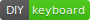
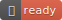

# 🍣 The Sushi Keyboard

 

## 🛠️ Recipes

* Base **PCB** and **electronic components**: [gherkin](https://github.com/di0ib/tmk_keyboard/tree/master/keyboard/gherkin)
* **Key caps**: Red colored flat keycaps.
* **Key switches**: Cherry compatiple Clear or White
  * e.g. GATERON Clear
* **Firmware**: `qmk`
  * 📝 Prototype layout is [available](./kbfirmware/) for [🔗Keyboard Firmware Builder](https://kbfirmware.com/).

TODO: Add photos of other keyboards which is based this keyboard.
